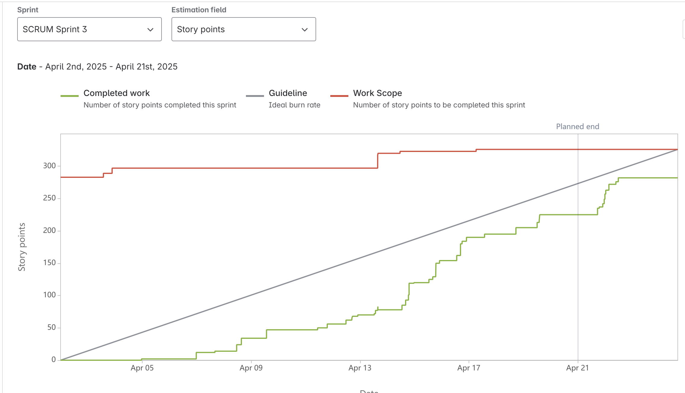

# On Par
#### This project is maintained by:
- Ariana Zapata
- Brandon Mason
- Jalen Stewart
- Natalie Morales
- Xavier Ortiz

> On Par is a two dimensional golf game for casual gamers who want a fun and relaxing game that they can play anytime, anywhere. Through simple controls and clear cut goals, our game will provide players with an experience that will challenge their precision and strategy skills. Through unlockable cosmetic items, the game will give the player a sense of achievement under little to no stress.

> We have not yet merged everthing into main so everything is in our merge-dev-and-UI branch

## Table of Contents
  - [General Information](#general-information)
  - [Technologies Used](#technologies-used)
  - [Sprint 1 Contributions](#sprint-1-contributions)
  - [Next Steps](#next-steps)
  - [Burnup Chart](#burnup chart for sprint 1)
  - [Sprint 2 Contributions](#sprint-2-contributions)
  - [Next Steps](#next-steps)
  - [Burnup Chart](#burnup chart for sprint 2)
  - [Sprint 3 Contributions](#sprint-3-contributions)
  - [Next Steps](#next-steps)
  - [Burnup Chart](#burnup chart for sprint 3)
  - [Features](#features)
  

## General Information

## Technologies Used
- [Unity Engine](https://unity.com/products/unity-engine)
- C#
- VSCode
- AI/ChatGPT

## Sprint 1 Contributions
Brandon Mason: 
Developed shot mechanics, including UI for power and angle selection, physics-based shot force calculations, and hole detection. Also worked on a game design document for golf club mechanics.

- SCRUM-11 Design and implement a UI for shot power and angle selection
    - Description: Created a user interface for players to select shot power and angle.
    - [Jira Link](https://cs3398-romulans-spring.atlassian.net/jira/software/projects/SCRUM/boards/1?selectedIssue=SCRUM-11)

- SCRUM-67 Add a hole to the board for the ball to go in to.
    - Description: Created a scoring system that maintains the player's total score across different levels while keeping track of individual level scores.
    - [Bitbucket Branch and Commit(s)](https://bitbucket.org/cs3398-romulans-s25/on-par/branch/SCRUM-67-add-a-hole-to-the-board-for-the)
    - [Pull Request](https://bitbucket.org/cs3398-romulans-s25/on-par/pull-requests/3)
    - [Jira Link](https://cs3398-romulans-spring.atlassian.net/jira/software/projects/SCRUM/boards/1?selectedIssue=SCRUM-67)

- SCRUM-12 Create a script to capture player input (mouse or keyboard) to adjust power and angle
    - Description: Developed input controls to modify shot power and angle.
    - [Bitbucket Branch and Commit(s)](https://bitbucket.org/cs3398-romulans-s25/on-par/branch/SCRUM-12-rebase-for-issue-key)
    - [Jira Link](https://cs3398-romulans-spring.atlassian.net/jira/software/projects/SCRUM/boards/1?selectedIssue=SCRUM-12)

- SCRUM-14 Test different force values to ensure smooth and predictable ball movement.
    - Description: Adjusted and tested force values for smooth ball motion.
    - [Jira Link](https://cs3398-romulans-spring.atlassian.net/jira/software/projects/SCRUM/boards/1?selectedIssue=SCRUM-14)

- SCRUM-13 Apply physics-based shot force calculations using Unity's Rigidbody2D (With visual display for aim and shot power).
    - Description: Integrated physics-based calculations for shot mechanics, including a visual display for aim and shot power.
    - [Bitbucket Branch and Commit(s)](https://bitbucket.org/cs3398-romulans-s25/on-par/branch/SCRUM-13-rebase-for-issue-key)
    - [Pull Request](https://bitbucket.org/cs3398-romulans-s25/on-par/pull-requests/3)
    - [Jira Link](https://cs3398-romulans-spring.atlassian.net/jira/software/projects/SCRUM/boards/1?selectedIssue=SCRUM-13)

- SCRUM-25 Create a game design document outlining the mechanics for each golf club type (Driver, Iron, and Putter).
    - Description: Documented golf club mechanics for the game, detailing differences between club types.
    - [Bitbucket Branch and Commit(s)](https://bitbucket.org/cs3398-romulans-s25/on-par/branch/SCRUM-25-alternate-method-using-scriptableobjects)
    - [Jira Link](https://cs3398-romulans-spring.atlassian.net/jira/software/projects/SCRUM/boards/1?selectedIssue=SCRUM-25)

Ariana Zapata:
Developed UI components, including the leaderboard panel, main menu UI, login UI, and guest functionality integration

- SCRUM-19 Design and implement a UI panel for the leaderboard.
    - Description: Created a leaderboard UI panel to display player rankings.
    - [Bitbucket Branch and Commit(s)](https://bitbucket.org/cs3398-romulans-s25/on-par/branch/SCRUM-19)
    - [Jira Link](https://cs3398-romulans-spring.atlassian.net/jira/software/projects/SCRUM/boards/1?selectedIssue=SCRUM-19)

- SCRUM-65 Integrate "Guest" Functionality
    - Description: Implemented guest login functionality to allow players to access the game without an account.
    - [Bitbucket Branch and Commit(s)](https://bitbucket.org/cs3398-romulans-s25/on-par/branch/SCRUM-65)
    - [Pull Request](https://bitbucket.org/cs3398-romulans-s25/on-par/pull-requests/14)
    - [Jira Link](https://cs3398-romulans-spring.atlassian.net/jira/software/projects/SCRUM/boards/1?selectedIssue=SCRUM-65)

- SCRUM-62 Design & Implement Main Menu UI
    - Description: Designed and implemented the main menu interface for easy game navigation.
    - [Bitbucket Branch and Commit(s)](https://bitbucket.org/cs3398-romulans-s25/on-par/branch/SCRUM-62)
    - [pull request](https://bitbucket.org/cs3398-romulans-s25/on-par/pull-requests/11)
    - [Jira Link](https://cs3398-romulans-spring.atlassian.net/jira/software/projects/SCRUM/boards/1?selectedIssue=SCRUM-62)

- SCRUM-63 Develop Login UI.
    - Description: Created a login UI that allows players to sign in and access their game progress.
    - [Bitbucket Branch and Commit(s)](https://bitbucket.org/cs3398-romulans-s25/on-par/branch/SCRUM-63)
    - [Jira Link](https://cs3398-romulans-spring.atlassian.net/jira/software/projects/SCRUM/boards/1?selectedIssue=SCRUM-62)

Natalie Morales: 
Implemented core gameplay mechanics, including stroke counting, score tracking, and golf club switching.

- SCRUM-49 Implement a user interface to display the current number of strokes per round
    - Description: Developed a stroke counter that tracks the number of strokes a player takes in a level.
    - [Bitbucket Branch and Commit(s)](https://bitbucket.org/cs3398-romulans-s25/on-par/branch/SCRUM-49-implement-a-user-interface-to-d)
    - [Jira Link](https://cs3398-romulans-spring.atlassian.net/jira/software/projects/SCRUM/boards/1?selectedIssue=SCRUM-49)

- SCRUM-48 Develop the logic to calculate the score for each hole and the cumulative total score.
    - Description: Created a scoring system that maintains the player's total score across different levels while keeping track of individual level scores.
    - [Bitbucket Branch and Commit(s)](https://bitbucket.org/cs3398-romulans-s25/on-par/branch/SCRUM-48-score-tracking-feature)
    - [Pull Request](https://bitbucket.org/cs3398-romulans-s25/on-par/pull-requests/13)
    - [Jira Link](https://cs3398-romulans-spring.atlassian.net/jira/software/projects/SCRUM/boards/1?selectedIssue=SCRUM-48)
    

 - SCRUM-27 implement a mechanism that allows you to switch between different clubs (driver, iron, putter)
    - Description: Allowed players to switch between different golf clubs (Driver, Iron, Putter), each affecting the shot differently.
    - [Bitbucket Branch and Commit(s)](https://bitbucket.org/cs3398-romulans-s25/on-par/branch/SCRUM-27-implement-a-mechanism-that-allo)
    - [Jira Link](https://cs3398-romulans-spring.atlassian.net/jira/software/projects/SCRUM/boards/1?selectedIssue=SCRUM-27)

Xavier Ortiz
Developed core gameplay levels, camera mechanics, and the Hole-in-One challenge logic and UI.

- SCRUM-60 Learning Unity
    - Description: Studied Unity development practices to better contribute to the project.
    - [Bitbucket Branch and Commit(s)](https://bitbucket.org/cs3398-romulans-s25/on-par/branch/SCRUM-60-learning-unity)
    - [Jira Link](https://cs3398-romulans-spring.atlassian.net/jira/software/projects/SCRUM/boards/1?selectedIssue=SCRUM-60)

- SCRUM-68 Making the camera following the golf ball/player
    - Description: Implemented a smooth camera-follow system to track the golf ball's movement.
    - [Bitbucket Branch and Commit(s)](https://bitbucket.org/cs3398-romulans-s25/on-par/branch/SCRUM-68-making-the-camera-following)
    - [Jira Link](https://cs3398-romulans-spring.atlassian.net/jira/software/projects/SCRUM/boards/1?selectedIssue=SCRUM-68)

 - SCRUM-34 Create 18 playable levels/courses for the game.
    - Description:  Designed and implemented 18 unique golf courses with different terrains and obstacles.
    - [Bitbucket Branch and Commit(s)](https://bitbucket.org/cs3398-romulans-s25/on-par/branches/?search=SCRUM-34)
    - [Jira Link](https://cs3398-romulans-spring.atlassian.net/jira/software/projects/SCRUM/boards/1?selectedIssue=SCRUM-34)

- SCRUM-70 Adding the hole script to all the levels
    - Description: Integrated hole detection mechanics into all game levels.
    - [Bitbucket Branch and Commit(s)](https://bitbucket.org/cs3398-romulans-s25/on-par/branch/SCRUM-70-adding-the-hole-script)
    - [Jira Link](https://cs3398-romulans-spring.atlassian.net/jira/software/projects/SCRUM/boards/1?selectedIssue=SCRUM-70)
    
- SCRUM-55 Design the Hole-in-One Challenge UI & Level Indicators
    - Description:  Created a UI display for the Hole-in-One challenge, including level indicators.
    - [Bitbucket Branch and Commit(s)](https://bitbucket.org/cs3398-romulans-s25/on-par/branch/SCRUM-55-design-the-hole-in-one-challenge)
    - [Jira Link](https://cs3398-romulans-spring.atlassian.net/jira/software/projects/SCRUM/boards/1?selectedIssue=SCRUM-55)

- SCRUM-56 Implement Hole-in-One Challenge Logic
    - Description: Developed the logic for the Hole-in-One challenge, ensuring correct scoring and mechanics.
    - [Bitbucket Branch and Commit(s)](https://bitbucket.org/cs3398-romulans-s25/on-par/branch/SCRUM-56-implement-hole-in-one-challenge)
    - [Jira Link](https://cs3398-romulans-spring.atlassian.net/jira/software/projects/SCRUM/boards/1?selectedIssue=SCRUM-56)

    

Jalen Stewart:
Developed obstacle and wind mechanics, including collision detection, wind trajectory effects, and UI elements for tracking wind direction.

 - SCRUM-29 Design the behavior and visual representation of obstacles (e.g., trees, water hazards, sand traps) and wind mechanics (e.g., direction, strength, visual indicators).
    - Description: Designed trees, water hazards, sand traps, and wind effects, including direction, strength, and visual indicators.
    - [Bitbucket Branch and Commit(s)](https://bitbucket.org/cs3398-romulans-s25/on-par/branch/SCRUM-29-design-the-behavior-and-visual-)
    - [Jira Link](https://cs3398-romulans-spring.atlassian.net/jira/software/projects/SCRUM/boards/1?selectedIssue=SCRUM-29)

- SCRUM-30 Implement obstacle collision detection and physics interactions in Unity.
    - Description: Developed physics-based interactions and collision detection for obstacles.
    - [Bitbucket Branch and Commit(s)](https://bitbucket.org/cs3398-romulans-s25/on-par/branch/SCRUM-30-implement-obstacle-collision-de)
    - [Jira Link](https://cs3398-romulans-spring.atlassian.net/jira/software/projects/SCRUM/boards/1?selectedIssue=SCRUM-30)

 - SCRUM-31 implement a mechanism that allows you to switch between different clubs (driver, iron, putter)
    - Description: Implemented wind effects that dynamically affect ball movement.fect ball movement.
    - [Bitbucket Branch and Commit(s)](https://bitbucket.org/cs3398-romulans-s25/on-par/branch/SCRUM-31-add-wind-mechanics-to-influence)
    - [Jira Link](https://cs3398-romulans-spring.atlassian.net/jira/software/projects/SCRUM/boards/1?selectedIssue=SCRUM-31)

- SCRUM-69 Create wind UI to track the wind and direction.
    - Description: Developed an on-screen UI to visually display wind direction and intensity.
    - [Bitbucket Branch and Commit(s)](https://bitbucket.org/cs3398-romulans-s25/on-par/branch/SCRUM-69-create-wind-ui-to-track-the-win)
    - [Jira Link](https://cs3398-romulans-spring.atlassian.net/jira/software/projects/SCRUM/boards/1?selectedIssue=SCRUM-69)
    

 - SCRUM-33 Add obstacles and wind to existing or new game courses.
    - Description: Integrated obstacles and wind mechanics into different golf course designs.
    - [Bitbucket Branch and Commit(s)](https://bitbucket.org/cs3398-romulans-s25/on-par/branch/SCRUM-33-adjust-sand-logic)
    - [Jira Link](https://cs3398-romulans-spring.atlassian.net/jira/software/projects/SCRUM/boards/1?selectedIssue=SCRUM-33)

## Next Steps for Sprint 2
  - Brandon Mason:
      - Start working on the server for account creation and score storage.
      - Create a secure sign up system.
      - Integrate the server into the login and leaderboard pages in the game.
  - Ariana Zapata:
      - Finish developing login system
      - Continue leaderboard development; keeping track of players' scores
      - Create seamless path from main menu to game
      - Make sure UI is consistent throughout the application
  - Natalie Morales
      - A feature that implements Lava pits that instantly reset the ball.
      - implement a neater and more in depth UI for features such as clubs, wind text, scores. 
      - Sync in-game lighting with the player's real-world time for a dynamic day-night cycle.
  - Xavier Ortiz: 
      - Continue working on my hole-in-challege and UI look
      - Create a reward track for completing the challeges
      - Create a couple of custom golf balls to choose from
  - Jalen Stewart:
      - Continue working on sand to make it more realistic
      - Add unique hazards and features that interact with the ball during the game
      - Create visual indicator for the shooting mechanic, a power meter

## Burnup Chart for Sprint 1

## Sprint 2 Contributions
Brandon Mason: 
Developed the backend server with database connections built with Node using TypeScript and Express. Also wrote the Unity methods to connect the game to the backend server.

- SCRUM-83
	- Description: Create a backend with an API that connects to the database.
	- [Bitbucket Branch and Commit(s)](https://bitbucket.org/cs3398-romulans-s25/%7B97904684-973f-4a89-aeae-8ca5feb4a5d4%7D/branch/SCRUM-83-create-a-backend-with-an-api-to)
	- Pull Request Not Necessary
	- [Jira Link](https://cs3398-romulans-spring.atlassian.net/browse/SCRUM-83)
- SCRUM-84
	- Description: Access the database and implement a system for adding, removing, and updating score entries.
    - [Bitbucket Branch and Commit(s)](https://bitbucket.org/cs3398-romulans-s25/%7B97904684-973f-4a89-aeae-8ca5feb4a5d4%7D/branch/SCRUM-84-access-the-database-and-impleme)
    - Pull Request Not Necessary
	- [Jira Link](https://cs3398-romulans-spring.atlassian.net/browse/SCRUM-84)
- SCRUM-85
	- Description: Create secure login method with unique username requirements and password encryption.
    - [Bitbucket Branch and Commit(s)](https://bitbucket.org/cs3398-romulans-s25/%7B97904684-973f-4a89-aeae-8ca5feb4a5d4%7D/branch/SCRUM-85-create-secure-login-method-with)
    - [Pull Request](https://bitbucket.org/%7B819012b1-8676-40ce-9231-5a0e59ffe448%7D/%7B97904684-973f-4a89-aeae-8ca5feb4a5d4%7D/pull-requests/19)
	- [Jira Link](https://cs3398-romulans-spring.atlassian.net/browse/SCRUM-85)
- SCRUM-88
	- Description: Write a Unity script with predefined methods to fetch common sets of data requested by the game.
    - [Bitbucket Branch and Commit(s)](https://bitbucket.org/cs3398-romulans-s25/on-par/branch/SCRUM-88-write-a-unity-script-with-prede)
    - [Pull Request](https://bitbucket.org/%7B819012b1-8676-40ce-9231-5a0e59ffe448%7D/%7B97904684-973f-4a89-aeae-8ca5feb4a5d4%7D/pull-requests/23)
	- [Jira Link](https://cs3398-romulans-spring.atlassian.net/browse/SCRUM-88)
- SCRUM-118
	- Description: Live updating for score changes.
    - [Bitbucket Branch and Commit(s)](https://bitbucket.org/cs3398-romulans-s25/%7B97904684-973f-4a89-aeae-8ca5feb4a5d4%7D/branch/SCRUM-118-live-updating-for-score-change)
    - [Pull Request](https://bitbucket.org/%7B819012b1-8676-40ce-9231-5a0e59ffe448%7D/%7B97904684-973f-4a89-aeae-8ca5feb4a5d4%7D/pull-requests/32)
	- [Jira Link](https://cs3398-romulans-spring.atlassian.net/browse/SCRUM-118)
- SCRUM-119
	- Description: Initialize MongoDB and Redis instances hosted online.
    - [Bitbucket Branch and Commit(s)](https://bitbucket.org/cs3398-romulans-s25/%7B97904684-973f-4a89-aeae-8ca5feb4a5d4%7D/branch/SCRUM-119-initialize-mongodb-and-redis-i)
    - Pull Request Not Necessary
	- [Jira Link](https://cs3398-romulans-spring.atlassian.net/browse/SCRUM-119)

Ariana Zapata:
Enhanced backend integration and expanded UI functionality, including login/signup database linkage, score tracking, AccountView development, and bug fixes.

- SCRUM-120 Main Menu/Login UI Updates
    Description: Made layout and button adjustments to improve usability and consistency in the main menu and login views.
    - [Bitbucket Branch and Commit(s)](https://bitbucket.org/cs3398-romulans-s25/on-par/branch/SCRUM-120-update-mainmenu-ui)
    - [Jira](https://cs3398-romulans-spring.atlassian.net/browse/SCRUM-120?atlOrigin=eyJpIjoiNTkyZjYwMjYxMzdhNDE1ZTk0ODUzZjZlNjcwNmM0MDIiLCJwIjoiaiJ9)

- SCRUM-121 Backend Integration with UI (Login/Signup + AccountView)
    Description:
    – Connected login and signup UI functionality to backend database methods.
    – Implemented OnLoginAttempt and OnSignupAttempt event handlers in LoginController.cs.
    – Created initial AccountView and AccountController components to display user info after login.
    – Set up navigation path to AccountMenu.
    – Iterated UI adjustments based on testing and feedback.
    - [Bitbucket Branch and Commit(s)](https://bitbucket.org/cs3398-romulans-s25/on-par/branch/SCRUM-121-connect-ui-to-backend-methods)
    - [Jira](https://cs3398-romulans-spring.atlassian.net/browse/SCRUM-121?atlOrigin=eyJpIjoiYzI0ZDM5MjcxZTk0NDZiYzk0ZTg4YjJkZTQ5OGVjODciLCJwIjoiaiJ9)

- SCRUM-111 Asset and UI Script Additions
    Description: Added new UI assets and scripts to support the AccountView and improve visual consistency.
    - [Bitbucket Branch and Commit(s)](https://bitbucket.org/cs3398-romulans-s25/on-par/branch/SCRUM-111-design-leaderboard-ui)
    - [Jira](https://cs3398-romulans-spring.atlassian.net/browse/SCRUM-111?atlOrigin=eyJpIjoiOGRmNDQ1ZjRiNzUwNDJjY2E1ZmQxMjMxYzQ4ZmZmMzMiLCJwIjoiaiJ9)

- SCRUM-116 Debugging and UI Fixes
    Description: Conducted extensive debugging of UI flow and backend integration. Fixed bugs, adjusted code logic, and ensured components (like GuestView, AccountView, LoginView) were correctly connected in the Unity project.
    - [Bitbucket Branch and Commit(s)](https://bitbucket.org/cs3398-romulans-s25/on-par/branch/SCRUM-116-test-debug)
    - [Pull Request](https://bitbucket.org/%7B819012b1-8676-40ce-9231-5a0e59ffe448%7D/%7B97904684-973f-4a89-aeae-8ca5feb4a5d4%7D/pull-requests/30)
    - [Jira](https://cs3398-romulans-spring.atlassian.net/browse/SCRUM-116?atlOrigin=eyJpIjoiYTA1Njg1M2ZiMWY0NDE4MTgzOTg0MzVhMmEwZTQxZGUiLCJwIjoiaiJ9)

Natalie Morales: 
Redesigned the levels on the UI development to look cohesive with Main Menu, implemented a settings panel that connects UI and levels through Guest, Created a prefab for wind animation using Unity’s particle effect, and created a soundManager to create instances of sounds throughout the game. 

- SCRUM-77 Create animation for wind into a prefab
    - Description: Used Unity’s particle effect to create wind animations that move and act  like wind.
    - [Bitbucket Branch and Commit(s)](https://bitbucket.org/cs3398-romulans-s25/on-par/branch/SCRUM-77-create-animation-to-enhance-use)
    - [Jira Link](https://cs3398-romulans-spring.atlassian.net/jira/software/projects/SCRUM/boards/1?selectedIssue=SCRUM-77)

- SCRUM-78 Implement subtle sound effect for hitting the golf ball
    - Description: Created SoundFXManager object and script that instantiates sounds throughout the game by creating an audio source of your choosing. We applied this to the ball to create a hitting sound. 
    - [Bitbucket Branch and Commit(s)](https://bitbucket.org/cs3398-romulans-s25/on-par/branch/SCRUM-78-implement-subtle-sound-effects-)
    - [Pull Request](https://bitbucket.org/%7B819012b1-8676-40ce-9231-5a0e59ffe448%7D/%7B97904684-973f-4a89-aeae-8ca5feb4a5d4%7D/pull-requests/20)
    - [Jira Link](https://cs3398-romulans-spring.atlassian.net/jira/software/projects/SCRUM/boards/1?selectedIssue=SCRUM-78)

- SCRUM-76 Create a UI that has consistent fonts, colors, and button styles across all screens and displays all player information (score, current club, etc.).
    - Description: Changed the UI to all the levels to better match the Main Menu graphics.
    - [Bitbucket Branch and Commit(s)](https://bitbucket.org/cs3398-romulans-s25/on-par/branch/SCRUM-76-Second-UI-branch)
    - [Jira Link](https://cs3398-romulans-spring.atlassian.net/jira/software/projects/SCRUM/boards/1?selectedIssue=SCRUM-76)

 
- SCRUM-79 Make a settings button/panel that allows you to change the game settings (volume, back button to main menu, skins, etc.
    - Description: Created a settings panel that is accessible from every level and inside the panel the player can access the main menu and vice versa. It connects through GuestController.
    - [Bitbucket Branch and Commit(s)](https://bitbucket.org/cs3398-romulans-s25/on-par/branch/SCRUM-79-make-a-settings-button-panel-th)
    - [Pull Request](https://bitbucket.org/cs3398-romulans-s25/on-par/pull-requests/31)
    - [Jira Link](https://cs3398-romulans-spring.atlassian.net/jira/software/projects/SCRUM/boards/1?selectedIssue=SCRUM-79)

Xavier Ortiz:
I finished implementing the challenge UI banner and logic and added rewards (coins) for completing the challenges, and just for completing the level, you were given rewards.

- SCRUM-93 Design & Implement UI for Challenges and Rewards (Unity UI)
    - Description: Create UI elements in Unity (e.g., TextMeshPro, UI Panels) to display the challenge details and earned rewards. Develop a C# script to update UI dynamically based on challenge progress and completion. Ensured UI scales properly across different screen resolutions.
    - [Bitbucket Branch and Commit(s)](https://bitbucket.org/cs3398-romulans-s25/on-par/branch/SCRUM-93-design-implement-ui-for-challen)
    - [Jira Link](https://cs3398-romulans-spring.atlassian.net/jira/software/projects/SCRUM/boards/1?selectedIssue=SCRUM-93)
    
- SCRUM-72 Hole In One Challenge Logic - Working off of SCRUM-56-55
    - Description: Pulling SCRUM-56: Implement Hole-in-One Challenge Logic into sprint 2 from sprint 1 to work on. Still need to add more quality changes and to make it run with team mates code.
    - [Bitbucket Branch and Commit(s)](https://bitbucket.org/cs3398-romulans-s25/%7B97904684-973f-4a89-aeae-8ca5feb4a5d4%7D/branch/SCRUM-72-hole-in-one-REDO)
    - [Jira Link](https://cs3398-romulans-spring.atlassian.net/jira/software/projects/SCRUM/boards/1?selectedIssue=SCRUM-72)

- SCRUM-71 Hole In One UI - Working off of SCRUM-55-56
    - Description: Pulling SCRUM-55: Design the Hole-in-One Challenge UI & Level Indicators into sprint 2 from sprint 1 to work on. Still need to add more quality changes and to make it run with team mates code. 
    - [Bitbucket Branch and Commit(s)](https://bitbucket.org/cs3398-romulans-s25/%7B97904684-973f-4a89-aeae-8ca5feb4a5d4%7D/branch/SCRUM-72-hole-in-one-REDO)
    - [Bitbucket Branch and Commit(s)](https://bitbucket.org/cs3398-romulans-s25/%7B97904684-973f-4a89-aeae-8ca5feb4a5d4%7D/branch/SCRUM-71-hole-in-one-UI-Continuing)
    - [Jira Link](https://cs3398-romulans-spring.atlassian.net/jira/software/projects/SCRUM/boards/1?selectedIssue=SCRUM-71)
    
- SCRUM-91 Implement Challenge Activation Logic in C# (Unity Script)
    - Description: Write a C# script in Unity to determine which holes have active challenges. Use Unity's ScriptableObject or GameManager to manage challenge activation conditions. Test by logging activations in Unity's console to ensure proper behavior. 
    - [Bitbucket Branch and Commit(s)](https://bitbucket.org/cs3398-romulans-s25/%7B97904684-973f-4a89-aeae-8ca5feb4a5d4%7D/branch/SCRUM-91-implement-challenge-activation-)
    - [Jira Link](https://cs3398-romulans-spring.atlassian.net/jira/software/projects/SCRUM/boards/1?selectedIssue=SCRUM-91)
    
- SCRUM-92 Develop Performance-Based Reward System in C#
    - Description: Create a C# script to calculate challenge performance (e.g., accuracy, completion time). Implement reward logic using Unity’s PlayerPrefs or a custom data-saving method. Ensure rewards are dynamically adjusted based on challenge difficulty.
    - [Bitbucket Branch and Commit(s)](https://bitbucket.org/cs3398-romulans-s25/%7B97904684-973f-4a89-aeae-8ca5feb4a5d4%7D/branch/SCRUM-92-develop-performance-based-rewar)
    - [Jira Link](https://cs3398-romulans-spring.atlassian.net/jira/software/projects/SCRUM/boards/1?selectedIssue=SCRUM-92)
    
- SCRUM-90 Design Challenge Mechanics & Reward System
    - Descriptions: Create a design document outlining the challenge types, scoring system, and reward tiers. Use a flowchart or state diagram to visualize how challenges activate and how rewards are assigned. Store the document in the Unity project folder for reference.
    - [Bitbucket Branch and Commit(s)](https://bitbucket.org/cs3398-romulans-s25/%7B97904684-973f-4a89-aeae-8ca5feb4a5d4%7D/branch/SCRUM-90-design-challenge-mechanics-rewa)
    - [Jira Link](https://cs3398-romulans-spring.atlassian.net/jira/software/projects/SCRUM/boards/1?selectedIssue=SCRUM-90)

Jalen Stewart:
Jalen Stewart: Created a power meter bar that synced the shot to correlate with the matching animation left room to add percentage text.Added different images and sprites into the prefabs. Began research for changing the layout for the sand hazard. 

- Scrum-107: Create a power meter UI with a specific visual style to fit games theme
- [Bitbucket Branch and Commit(s)] https://bitbucket.org/cs3398-romulans-s25/on-par/branch/SCRUM-107-create-power-meter-ui
- [Jira Link]https://cs3398-romulans-spring.atlassian.net/jira/software/projects/SCRUM/boards/1?selectedIssue=SCRUM-107

- Scrum-106: Implement the power meter logic 
- [Bitbucket Branch and Commit(s)] https://bitbucket.org/cs3398-romulans-s25/on-par/branch/SCRUM-106-design-the-power-meter-ui
- [Jira Link]https://cs3398-romulans-spring.atlassian.net/jira/software/projects/SCRUM/boards/1?selectedIssue=SCRUM-106

- Scrum-108: Sync Power Meter With Shot Strength
- [Bitbucket Branch and Commit(s)] https://bitbucket.org/cs3398-romulans-s25/on-par/branch/SCRUM-108-sync-power-meter-with-shot-str
- [Jira Link]https://cs3398-romulans-spring.atlassian.net/jira/software/projects/SCRUM/boards/1?selectedIssue=SCRUM-108

- Scrum-109: Test Power Meter Usability
- [Bitbucket Branch and Commit(s)] https://bitbucket.org/cs3398-romulans-s25/on-par/branch/SCRUM-109-test-power-meter-usability
- [Jira Link]https://cs3398-romulans-spring.atlassian.net/jira/software/projects/SCRUM/boards/1?selectedIssue=SCRUM-109
- Pull Request: https://bitbucket.org/cs3398-romulans-s25/on-par/pull-requests/29

## Next Steps for Sprint 3

- Brandon Mason: 
    - Add any other necessary fields to the database. Currently managing coins, purchased rewards, and challenge completion status wil need to be added.
    - Make server error messages display on various parts of the game UI(i.e. Incorrect username or password message in login screen).
    - Implement the leaderboard and write the necessary methods to integrate it with Unity.

- Ariana Zapata:
    - Connect Leaderboard to Database: Implement backend integration for the leaderboard so it displays real-time player rankings based on scores stored in the database.
    - Finalize Leaderboard UI: Polish the visual design of the leaderboard panel and ensure it dynamically updates with correct styling and scroll behavior.
    - Implement "All Levels" View: Create a new UI view that allows users to access any previously unlocked level. Ensure this view reflects the player's progress and includes locked/unlocked states visually.
    - Add Password Visibility Toggle: Enhance the login UI with a security feature that allows users to toggle visibility of their typed password (e.g., a "show/hide" eye icon).

- Natalie Morales: 
    - Working with team to incorporate the wind animations prefab to work with a wind api so it follows the same direction.
    - redesigning score manager so the player can start from any level once unlocked.
    - connect sounds to the volume slider in settings and add background music that a player can personalize. 

- Xavier Ortiz:
    - Create a daily reward tracker for every time the user logs in to the game. Will be given coins or maybe cosmetics.
    - Create 6-10 challenge levels that are based on the hole-in-one challenge, that you only have a few attempts to beat or else you restart.
    - Make a UI that shows up after you complete a levels which you can exit the game or restart level, etc.,instead of just force loading the level.

- Jalen Stewart:
    - Complete Sand and other hazards for more uniqueness and playability
    - Implement an API to effect the wind patterns in a more durastic way
    - Creating the UI for the rewards panel

## Burnup Chart for Sprint 2

## Sprint 3 Contributions
Brandon Mason: Continued with server development which included implementing a leaderboard, a rewards system, and any other functions that fetched data relevant to the frontend.  Also helped resolve any bugs that may have been present in the UI.

- SCRUM-137: 
	- Description: Add a text area to the login and register forms and show the response message from the server..
	- [Bitbucket Branch and Commit(s)](https://bitbucket.org/cs3398-romulans-s25/%7B97904684-973f-4a89-aeae-8ca5feb4a5d4%7D/branch/SCRUM-137-add-a-text-area-to-the-login-a)
	- [Pull Request](https://bitbucket.org/%7B819012b1-8676-40ce-9231-5a0e59ffe448%7D/%7B97904684-973f-4a89-aeae-8ca5feb4a5d4%7D/pull-requests/59)
	- [Jira Link](https://cs3398-romulans-spring.atlassian.net/browse/SCRUM-137?atlOrigin=eyJpIjoiYjlhZDk5YzNiMDdkNDdkMGJlYTkxNTUwMDEwMGY1YTciLCJwIjoiaiJ9)
- SCRUM-148
	- Description: Set up schema for storing coins and rewards.
    - [Bitbucket Branch and Commit(s)](https://bitbucket.org/%7B%7D/%7B97904684-973f-4a89-aeae-8ca5feb4a5d4%7D/branch/SCRUM-148-set-up-schema-for-storing-coin)
    - Pull Request Not Necessary
	- [Jira Link](https://cs3398-romulans-spring.atlassian.net/jira/software/projects/SCRUM/boards/1?selectedIssue=SCRUM-148)
- SCRUM-160
	- Description: Create a connection to the leaderboard within server.
    - [Main Bitbucket Branch and Commit(s)](https://bitbucket.org/%7B%7D/%7B97904684-973f-4a89-aeae-8ca5feb4a5d4%7D/branch/SCRUM-160-create-a-connection-to-the-leah)
    - [Bitbucket Branch and Commit(s)](https://bitbucket.org/%7B%7D/%7B97904684-973f-4a89-aeae-8ca5feb4a5d4%7D/branch/SCRUM-160-resolve-merge-conflicts)
    - Pull Request Not Necessary
	- [Jira Link](https://cs3398-romulans-spring.atlassian.net/jira/software/projects/SCRUM/boards/1?selectedIssue=SCRUM-160)
- SCRUM-170
	- Description: Write functions to add scores, get the top users, and get information for an individual user.
    - [Bitbucket Branch and Commit(s)](https://bitbucket.org/%7B%7D/%7B97904684-973f-4a89-aeae-8ca5feb4a5d4%7D/branch/SCRUM-170-write-functions-to-add-scores-)
    - [Pull Request](https://bitbucket.org/%7B819012b1-8676-40ce-9231-5a0e59ffe448%7D/%7B97904684-973f-4a89-aeae-8ca5feb4a5d4%7D/pull-requests/44)
	- [Jira Link](https://cs3398-romulans-spring.atlassian.net/jira/software/projects/SCRUM/boards/1?selectedIssue=SCRUM-170)
- SCRUM-175
	- Description: Create routes to add and subtract coins.
    - [Bitbucket Branch and Commit(s)](https://bitbucket.org/%7B%7D/%7B97904684-973f-4a89-aeae-8ca5feb4a5d4%7D/branch/SCRUM-175-create-routes-to-add-and-subtr)
    - Pull Request Not Necessary
	- [Jira Link](https://cs3398-romulans-spring.atlassian.net/jira/software/projects/SCRUM/boards/1?selectedIssue=SCRUM-175)
- SCRUM-178
	- Description: Create route to fetch rewards.
    - [Bitbucket Branch and Commit(s)](https://bitbucket.org/%7B%7D/%7B97904684-973f-4a89-aeae-8ca5feb4a5d4%7D/branch/SCRUM-178-create-route-to-fetch-rewards)
    - Pull Request Not Necessary
	- [Jira Link](https://cs3398-romulans-spring.atlassian.net/jira/software/projects/SCRUM/boards/1?selectedIssue=SCRUM-178)
- SCRUM-182
	- Description: Create route to purchase rewards.
    - [Bitbucket Branch and Commit(s)](https://bitbucket.org/cs3398-romulans-s25/%7B97904684-973f-4a89-aeae-8ca5feb4a5d4%7D/branch/SCRUM-119-initialize-mongodb-and-redis-i)
    - Pull Request Not Necessary
	- [Jira Link](https://cs3398-romulans-spring.atlassian.net/browse/SCRUM-119)
- SCRUM-187
	- Description: Write Unity functions to get leaderboard and rewards data from the server API.
    - [Bitbucket Branch and Commit(s)](https://bitbucket.org/%7B%7D/%7B97904684-973f-4a89-aeae-8ca5feb4a5d4%7D/branch/SCRUM-187-write-unity-functions-to-get-l)
    - [Pull Request](https://bitbucket.org/%7B819012b1-8676-40ce-9231-5a0e59ffe448%7D/%7B97904684-973f-4a89-aeae-8ca5feb4a5d4%7D/pull-requests/53)
	- [Jira Link](https://cs3398-romulans-spring.atlassian.net/jira/software/projects/SCRUM/boards/1?selectedIssue=SCRUM-187)
- SCRUM-196
	- Description: Consolidate rewards tasks.
    - [Bitbucket Branch and Commit(s)](https://bitbucket.org/%7B%7D/%7B97904684-973f-4a89-aeae-8ca5feb4a5d4%7D/branch/SCRUM-196-consolidate-rewards-tasks)
    - [Pull Request](https://bitbucket.org/%7B819012b1-8676-40ce-9231-5a0e59ffe448%7D/%7B97904684-973f-4a89-aeae-8ca5feb4a5d4%7D/pull-requests/50)
	- [Jira Link](https://cs3398-romulans-spring.atlassian.net/jira/software/projects/SCRUM/boards/1?selectedIssue=SCRUM-196)
- SCRUM-201
	- Description: Rework score update authorization.
    - [Bitbucket Branch and Commit(s)](https://cs3398-romulans-spring.atlassian.net/jira/software/projects/SCRUM/boards/1?selectedIssue=SCRUM-201)
    - [Pull Request](https://bitbucket.org/%7B819012b1-8676-40ce-9231-5a0e59ffe448%7D/%7B97904684-973f-4a89-aeae-8ca5feb4a5d4%7D/pull-requests/49)
	- [Jira Link](https://cs3398-romulans-spring.atlassian.net/jira/software/projects/SCRUM/boards/1?selectedIssue=SCRUM-201)
- SCRUM-202
	- Description: Add function to scoresController to fetch all scores per course for one user.
    - [Bitbucket Branch and Commit(s)](https://bitbucket.org/%7B%7D/%7B97904684-973f-4a89-aeae-8ca5feb4a5d4%7D/branch/SCRUM-202-add-function-to-scorescontroll)
    - Pull Request Not Necessary
	- [Jira Link](https://cs3398-romulans-spring.atlassian.net/jira/software/projects/SCRUM/boards/1?selectedIssue=SCRUM-202)
- SCRUM-203
	- Description: Create Unity function for fetching all of a single user's scores.
    - [Bitbucket Branch and Commit(s)](https://bitbucket.org/cs3398-romulans-s25/%7B97904684-973f-4a89-aeae-8ca5feb4a5d4%7D/branch/SCRUM-119-initialize-mongodb-and-redis-i)
    - Pull Request Not Necessary
	- [Jira Link](https://cs3398-romulans-spring.atlassian.net/browse/SCRUM-119)
- SCRUM-204
	- Description: Test Unity router functions with CoinManager.
    - [Bitbucket Branch and Commit(s)](https://bitbucket.org/cs3398-romulans-s25/on-par/branch/Connect-coins-to-server)
    - [Pull Request](https://bitbucket.org/cs3398-romulans-s25/on-par/pull-requests/65)
	- [Jira Link](https://cs3398-romulans-spring.atlassian.net/jira/software/projects/SCRUM/boards/1?selectedIssue=SCRUM-204)
- SCRUM-206
	- Description: Add log out feature to the backend.
    - [Bitbucket Branch and Commit(s)](https://bitbucket.org/%7B%7D/%7B97904684-973f-4a89-aeae-8ca5feb4a5d4%7D/branch/SCRUM-206-add-log-out-feature-to-the-bac)
    - [Pull Request](https://bitbucket.org/%7B819012b1-8676-40ce-9231-5a0e59ffe448%7D/%7B97904684-973f-4a89-aeae-8ca5feb4a5d4%7D/pull-requests/61)
	- [Jira Link](https://cs3398-romulans-spring.atlassian.net/jira/software/projects/SCRUM/boards/1?selectedIssue=SCRUM-206)
- SCRUM-207
	- Description: Add logout feature to the frontend.
    - [Bitbucket Branch and Commit(s)](https://bitbucket.org/%7B%7D/%7B97904684-973f-4a89-aeae-8ca5feb4a5d4%7D/branch/SCRUM-207-add-logout-feature-to-the-fron)
    - Pull Request Not Necessary
	- [Jira Link](https://cs3398-romulans-spring.atlassian.net/jira/software/projects/SCRUM/boards/1?selectedIssue=SCRUM-207)

Ariana Zapata:Enhanced backend integration and expanded UI functionality, including level access tracking, leaderboard database syncing, and customizable user settings.

- SCRUM-149 Implement "All Levels" View
    - Description: Created a UI panel that displays all unlocked levels, locks inaccessible ones, and handles page switching. Integrated user progress logic for dynamic level status.
    - [Bitbucket Branch and Commit(s)](https://bitbucket.org/cs3398-romulans-s25/on-par/branch/SCRUM-149-implement-all-levels-view-crea)
    - [Jira Link](https://cs3398-romulans-spring.atlassian.net/browse/SCRUM-149?atlOrigin=eyJpIjoiZWVhM2I0NTg4ZTYwNDU5ZTg5ZjRlNmEzY2VhMDIxZjUiLCJwIjoiaiJ9)
    - [Pull Request](https://bitbucket.org/cs3398-romulans-s25/on-par/pull-requests/67)

- SCRUM-186 Implement Customizations
    - Description: Built AccountSettingsView with toggles for sound/music. Connected view to controller and prepared for dynamic stat population.
    - [Bitbucket Branch and Commit(s)](https://bitbucket.org/cs3398-romulans-s25/on-par/branch/SCRUM-186-implement-customizations)
    - [Jira Link](https://cs3398-romulans-spring.atlassian.net/browse/SCRUM-186?atlOrigin=eyJpIjoiMTI1MjFjZTBmMTFjNGE3YmE5YjExNTc0OWY3NGQyYzkiLCJwIjoiaiJ9)
    - [Pull Request](https://bitbucket.org/cs3398-romulans-s25/on-par/pull-requests/55)

- SCRUM-138 Connect Leaderboard to Database
    - Description: Replaced mock leaderboard with dynamic data pulled from backend (Redis + MongoDB). Adjusted UI to highlight current user and top players.
    - [Bitbucket Branch and Commit(s)](https://bitbucket.org/cs3398-romulans-s25/on-par/branch/SCRUM-138-connect-leaderboard-to-databas)
    - [Jira Link](https://cs3398-romulans-spring.atlassian.net/browse/SCRUM-138?atlOrigin=eyJpIjoiZWU4MzE4MzI1ZTUzNDVhZGE3OWVkNjk5NTRjY2U5ZmQiLCJwIjoiaiJ9)
    - [Pull Request](https://bitbucket.org/cs3398-romulans-s25/on-par/pull-requests/41)
    
-  SCRUM-151 Add Password Visibility Toggle
    - Description: Enhanced login UX with show/hide toggle for password input using an eye icon in LoginView.
    - [Bitbucket Branch and Commit(s)](https://bitbucket.org/cs3398-romulans-s25/on-par/branch/SCRUM-151-add-password-visibility-toggle)
    - [Jira Link](https://cs3398-romulans-spring.atlassian.net/browse/SCRUM-151?atlOrigin=eyJpIjoiN2U5ZGFmMTVhMTM0NDI2MjhiYWI4MGIxMjhkZmFjYmEiLCJwIjoiaiJ9)
    - [Pull Request](https://bitbucket.org/cs3398-romulans-s25/on-par/pull-requests/36)

- SCRUM-184 Create Settings Panel UI (Declined)
    - Description: Initial development of settings panel; replaced by consolidated task SCRUM-186.
    - [Bitbucket Branch and Commit(s)](https://bitbucket.org/cs3398-romulans-s25/on-par/branch/SCRUM-184-create-settings-panel-ui)
    - [Jira Link](https://cs3398-romulans-spring.atlassian.net/browse/SCRUM-184?atlOrigin=eyJpIjoiYTI0NjE5YjQ0NWQ1NGMwNDkxNjA4MDY5OTNjMDc1ZGQiLCJwIjoiaiJ9)
    - [Pull Request](https://bitbucket.org/cs3398-romulans-s25/on-par/pull-requests/48)

Natalie Morales: 
This sprint I created and linked audio for our game, created custom skins to use as rewards, and refactored old code and bugs to better improve the quality of our game. 

- SCRUM 156 Connect all sound effects and music AudioSources to a central AudioMixer.
    - Description: Created an audio mixer system through unity and linked it to our soundEffects and our new background music. 
    - [Bitbucket Branch and Commit(s)](https://bitbucket.org/cs3398-romulans-s25/on-par/branch/SCRUM-156-connect-all-sound-effects-and-)
    - [Jira Link](https://cs3398-romulans-spring.atlassian.net/jira/software/projects/SCRUM/boards/1?selectedIssue=SCRUM-156)
    
- SCRUM 158 Link the volume slider UI to the AudioMixer to control master volume.
    - Description: Linked the sound system from scrum-156 to UI on all levels. Linked audio mixer to sliders inside settings panel and created a Volume Settings Manager to control this through user input. 
    - [Bitbucket Branch and Commmit(s)](https://bitbucket.org/cs3398-romulans-s25/on-par/branch/SCRUM-158-link-the-volume-slider-ui-to-t)
    - [Jira Link](https://cs3398-romulans-spring.atlassian.net/jira/software/projects/SCRUM/boards/1?selectedIssue=SCRUM-158)
    - [Pull Request](https://bitbucket.org/%7B819012b1-8676-40ce-9231-5a0e59ffe448%7D/%7B97904684-973f-4a89-aeae-8ca5feb4a5d4%7D/pull-requests/46)

- SCRUM-165 Refactor ScoreManager to support per-level score tracking.
    - Description: Updated ScoreManager to support starting from any level, not just level one. Added a ScoreManager instance to each level for consistent score tracking.
    - [Bitbucket Branch and Commit(s)](https://bitbucket.org/cs3398-romulans-s25/on-par/branch/SCRUM-172-refactoringScoreManager)
    - [Jira Link](https://cs3398-romulans-spring.atlassian.net/jira/software/projects/SCRUM/boards/1?selectedIssue=SCRUM-172)
    - [Pull Request](https://bitbucket.org/%7B819012b1-8676-40ce-9231-5a0e59ffe448%7D/%7B97904684-973f-4a89-aeae-8ca5feb4a5d4%7D/pull-requests/47)
    
- SCRUM-177  Design and create several custom ball prefabs (textures, models, or materials).
    - Description: Created a BallSkinManager that allows a player to choose between different sprites once unlocked/purchased with coins.
    - [Bitbucket Branch and Commit(s)](https://bitbucket.org/cs3398-romulans-s25/on-par/branch/SCRUM-177-design-and-create-several-cust)
    - [Jira Link](https://cs3398-romulans-spring.atlassian.net/jira/software/projects/SCRUM/boards/1?selectedIssue=SCRUM-177)
    - [Pull Request](https://bitbucket.org/%7B819012b1-8676-40ce-9231-5a0e59ffe448%7D/%7B97904684-973f-4a89-aeae-8ca5feb4a5d4%7D/pull-requests/66)
    
- SCRUM-179 Fix Hole text so it updates for each scene
    - Description: Created a HoleIncreamenter script and object and attached the hole text to it so that each scene is labeled properly.
    - [Bitbucket Branch and Commit(s)](https://bitbucket.org/cs3398-romulans-s25/on-par/branch/SCRUM-179-fix-hole-text-so-it-updates-fo)
    - [Jira Link](https://cs3398-romulans-spring.atlassian.net/jira/software/projects/SCRUM/boards/1?selectedIssue=SCRUM-179) 
    - [Pull Request](https://bitbucket.org/%7B819012b1-8676-40ce-9231-5a0e59ffe448%7D/%7B97904684-973f-4a89-aeae-8ca5feb4a5d4%7D/pull-requests/70)
    
Xavier Ortiz:
I created six challenge levels designed to test your hole-in-one skills, implemented the post-level screen pop-up and transition functions, and developed the daily reward tracker system.

- SCRUM-163 Set Up Rewards & Progression
    - Description: Implement a system that grants rewards for successful completions and unlocks new challenges in sequence.
    - [Bitbucket Branch and Commit(s)](https://bitbucket.org/cs3398-romulans-s25/%7B97904684-973f-4a89-aeae-8ca5feb4a5d4%7D/branch/SCRUM-163-set-up-rewards-progression)
    - [Jira Link](https://cs3398-romulans-spring.atlassian.net/jira/software/projects/SCRUM/boards/1?selectedIssue=SCRUM-163)
    
- SCRUM-173 Test & Polish UI Interactions
    - Description: Ensure smooth animations, responsive buttons, and a seamless transition between game states.
    - [Bitbucket Branch and Commit(s)](https://bitbucket.org/cs3398-romulans-s25/%7B97904684-973f-4a89-aeae-8ca5feb4a5d4%7D/branch/SCRUM-173-test-polish-ui-interactions)
    - [Jira Link](https://cs3398-romulans-spring.atlassian.net/jira/software/projects/SCRUM/boards/1?selectedIssue=SCRUM-173)

- SCRUM-194 Test Execution and Results
    - Description: Will include the results for Button Functionality Result, Coin Amount Result, and Hole-in-One Banner Result.
    - [Bitbucket Branch and Commit(s)](https://bitbucket.org/cs3398-romulans-s25/%7B97904684-973f-4a89-aeae-8ca5feb4a5d4%7D/commits/927592b535c878ab9edc46c06e5811467a2dbfe0)
    - [Jira Link](https://cs3398-romulans-spring.atlassian.net/jira/software/projects/SCRUM/boards/1?selectedIssue=SCRUM-194)
    
- SCRUM-193 3 Unity unit tests - Testing Plan
    - Description: Button Functionality Test: TestStartButtonInvokesGameStart() checks that pressing the in-game menu button successfully triggers when the game is running.
        Coin Amount Test: TestCoinRewardOnLevelComplete() verifies that the player receives the correct number of coins when being called.
        Hole-in-One Banner Test: TestHoleInOneBannerAppears() ensures the 'Hole-in-One Challenge' banner displays when being called.
    - [Bitbucket Branch and Commit(s)](https://bitbucket.org/cs3398-romulans-s25/%7B97904684-973f-4a89-aeae-8ca5feb4a5d4%7D/branch/SCRUM-193-3-unity-unit-tests---testing-p)
    - [Jira Link](https://cs3398-romulans-spring.atlassian.net/jira/software/projects/SCRUM/boards/1?selectedIssue=SCRUM-193)
    
- SCRUM-171 Ensure Proper Level Flow Handling
    - Description: Modify the level transition system to wait for player input before advancing.
    - [Bitbucket Branch and Commit(s)](https://bitbucket.org/cs3398-romulans-s25/%7B97904684-973f-4a89-aeae-8ca5feb4a5d4%7D/branch/SCRUM-171-ensure-proper-level-flow-handl)
    - [Jira Link](https://cs3398-romulans-spring.atlassian.net/jira/software/projects/SCRUM/boards/1?selectedIssue=SCRUM-171)
    
- SCRUM-167 Implement Navigation Logic
    - Descriptions: Write the code to handle button interactions for Restart, Continue, and Exit.
    - [Bitbucket Branch and Commit(s)](https://bitbucket.org/cs3398-romulans-s25/%7B97904684-973f-4a89-aeae-8ca5feb4a5d4%7D/branch/SCRUM-167-implement-navigation-logic)
    - [Jira Link](https://cs3398-romulans-spring.atlassian.net/jira/software/projects/SCRUM/boards/1?selectedIssue=SCRUM-167)
    
- SCRUM-166 Create Post-Level UI Panel
    - Descriptions: Design a UI screen that appears after a level is completed, giving players options for their next action.
    - [Bitbucket Branch and Commit(s)](https://bitbucket.org/cs3398-romulans-s25/%7B97904684-973f-4a89-aeae-8ca5feb4a5d4%7D/branch/SCRUM-166-create-post-level-ui-panel)
    - [Jira Link](https://cs3398-romulans-spring.atlassian.net/jira/software/projects/SCRUM/boards/1?selectedIssue=SCRUM-166)
    
- SCRUM-161 Design & Create 6-10 Challenge Levels
    - Descriptions: Develop and place obstacles in unique level layouts that require a hole-in-one to complete.
    - [Bitbucket Branch and Commit(s)](https://bitbucket.org/cs3398-romulans-s25/%7B97904684-973f-4a89-aeae-8ca5feb4a5d4%7D/branch/SCRUM-161-design-create-6-10-challenge-l)
    - [Jira Link](https://cs3398-romulans-spring.atlassian.net/jira/software/projects/SCRUM/boards/1?selectedIssue=SCRUM-161)
    
- SCRUM-162 Implement Limited Attempt System
    - Descriptions: Add logic to track player attempts and prevent further attempts once the limit is reached. 
    - [Bitbucket Branch and Commit(s)](https://bitbucket.org/cs3398-romulans-s25/%7B97904684-973f-4a89-aeae-8ca5feb4a5d4%7D/branch/SCRUM-162-implement-limited-attempt-syst)
    - [Jira Link](https://cs3398-romulans-spring.atlassian.net/jira/software/projects/SCRUM/boards/1?selectedIssue=SCRUM-162)
    
- SCRUM-155 Create UI for Reward Display
    - Descriptions: Design a UI panel that displays the current reward, streak progress, and upcoming rewards.
    - [Bitbucket Branch and Commit(s)](https://bitbucket.org/cs3398-romulans-s25/%7B97904684-973f-4a89-aeae-8ca5feb4a5d4%7D/branch/SCRUM-155-create-ui-for-reward-display)
    - [Jira Link](https://cs3398-romulans-spring.atlassian.net/jira/software/projects/SCRUM/boards/1?selectedIssue=SCRUM-155)
    
- SCRUM-154 Design & Implement Reward Distribution
    - Descriptions:Define and implement logic to grant coins or cosmetics based on the number of consecutive logins.
    - [Bitbucket Branch and Commit(s)](https://bitbucket.org/cs3398-romulans-s25/%7B97904684-973f-4a89-aeae-8ca5feb4a5d4%7D/branch/SCRUM-154-design-implement-reward-distri)
    - [Jira Link](https://cs3398-romulans-spring.atlassian.net/jira/software/projects/SCRUM/boards/1?selectedIssue=SCRUM-154)
    
- SCRUM-164 Add UI Feedback & Restart Logic
    - Descriptions: Display the number of remaining attempts on-screen and trigger an automatic restart when all attempts are used.
    - [Bitbucket Branch and Commit(s)](https://bitbucket.org/cs3398-romulans-s25/%7B97904684-973f-4a89-aeae-8ca5feb4a5d4%7D/branch/SCRUM-164-add-ui-feedback-restart-logic)
    - [Jira Link](https://cs3398-romulans-spring.atlassian.net/jira/software/projects/SCRUM/boards/1?selectedIssue=SCRUM-164)
    
    

Jalen Stewart:
 I worked on integrating real-time wind using the OpenWeatherMap API and improved how wind affects ball movement in the game. I also refined the sand trap mechanics to feel more balanced and less abrupt. I began designing the shop UI, connecting it to the settings menu and laying out the foundation for item slots and navigation.

 - SCRUM-132 Research and select an appropriate wind API
    - Descriptions: Implemented the foundational wind system that generates direction and strength, displays them on screen, and integrates early wind logic into gameplay.
    - [Bitbucket Branch and Commit(s)](https://bitbucket.org/cs3398-romulans-s25/on-par/branch/SCRUM-135-modify-the-ui-element-that-dis)
    - [Jira Link](https://cs3398-romulans-spring.atlassian.net/browse/SCRUM-132)

- SCRUM-133 Add wind display UI to game HUD
    - Descriptions:  Created the user interface for displaying wind direction and strength in a player-friendly format during gameplay.
    - [Bitbucket Branch and Commit(s)](https://bitbucket.org
    cs3398-romulans-s25/on-par/branch/SCRUM-133-set-up-the-api-integration-to-)
    - [Jira Link](https://cs3398-romulans-spring.atlassian.net/browse/SCRUM-133)

- SCRUM-134 Adjust wind impact on ball movement
    - Descriptions:  Adjusted wind mechanics to create more noticeable but balanced effects on ball movement, including gust variability.
    - [Bitbucket Branch and Commit(s)](https://bitbucket.org/cs3398-romulans-s25/on-par/branch/SCRUM-134-modify-the-wind-logic-in-the-g)
    - [Jira Link](https://cs3398-romulans-spring.atlassian.net/browse/SCRUM-134)
    
- SCRUM-135 Fix wind display alignment and visual clarity
    - Descriptions: Improved the position and visuals of the wind display, including arrow icons for clearer directional feedback.
    - [Bitbucket Branch and Commit(s)](https://bitbucket.org/cs3398-romulans-s25/on-par/branch/SCRUM-135-modify-the-ui-element-that-dis)
    - [Jira Link](https://cs3398-romulans-spring.atlassian.net/browse/SCRUM-135)
    
- SCRUM-168 Redesign sand trap visuals
    - Descriptions: Replaced outdated sand sprites with more visually appealing assets to enhance level design aesthetics.
    - [Bitbucket Branch and Commit(s)](https://bitbucket.org/cs3398-romulans-s25/on-par/branch/SCRUM-168-refactor-the-sand-logic-to-mak)
    - [Jira Link](https://cs3398-romulans-spring.atlassian.net/browse/SCRUM-168)
    
- SCRUM-174 Refactor sand trap physics
    - Descriptions: Balanced sand physics by adjusting velocity dampening and force multipliers to avoid abrupt halts while preserving challenge.
    [Bitbucket Branch and Commit(s)] Not needed, was just to test the code
    - [Jira Link](https://cs3398-romulans-spring.atlassian.net/browse/SCRUM-174)
    
- SCRUM-140 Design shop popup panel
    - Descriptions: Created an intuitive, grid-based popup shop UI accessible from the settings menu, with item slots and support for future store features.
    - [Bitbucket Branch and Commit(s)](https://bitbucket.org/cs3398-romulans-s25/on-par/branch/SCRUM-140-design-the-shop-ui-including-e)
    - [Jira Link](https://cs3398-romulans-spring.atlassian.net/browse/SCRUM-140)
    
- SCRUM-142 Hook up shop button to open shop UI
    - Descriptions: Implemented logic to open and close the shop UI from the settings menu with smooth transitions and isolated control.
    - [Bitbucket Branch and Commit(s)](https://bitbucket.org/cs3398-romulans-s25/on-par/branch/SCRUM-177-design-and-create-several-cust)
    - [Jira Link](https://cs3398-romulans-spring.atlassian.net/browse/SCRUM-142)
    
- SCRUM-197 Write unit test plan for Power Meter & Wind API
    - Descriptions: Wrote a unit test plan targeting power meter visibility and API wind data parsing, structured for reproducibility.
    - [Bitbucket Branch and Commit(s)](https://bitbucket.org/cs3398-romulans-s25/on-par/branch/SCRUM-197-testing-plan-3-unit-tests)
    - [Jira Link](https://cs3398-romulans-spring.atlassian.net/browse/SCRUM-197)
    
- SCRUM-198 Run unit tests and record results
    - Descriptions: Executed and documented test results for power meter activation and wind behavior, including manual test confirmations and logs.
    - [Bitbucket Branch and Commit(s)](https://bitbucket.org/cs3398-romulans-s25/on-par/branch/SCRUM-198-results-execution-3-unit-tests)
    - [Jira Link](https://cs3398-romulans-spring.atlassian.net/browse/SCRUM-198)

## Next Steps for Future Development
- Brandon Mason:
    - Make sure the current frontend backend connections work as intended.
    - Connect the rewards system to the Unity HTTP methods connecting to the user rewards database.
    - Search for bugs and fix them.

- Xavier Ortiz: 
    - Polishing the daily reward featur by adding more rewards to unlock and adding notifications
    - Fixing bugs that impact the coin function - like making sure you are being rewarded the correct amount
    - Adding more unique challenge levels and expanding opportunities for players to take on special challenges

- Ariana Zapata:
    - Polish animation transitions between views (main menu, settings, leaderboard).
    - Complete backend endpoint for storing achievement progress.
    - Refactor AccountSettingsView to fully reflect user stats dynamically from server.

- Natalie Morales:
    - Create a user-friendly music selection menu that allows players to choose from a curated list of background tracks.
    - Add a Mystery Box feature: Get a random cosmetic reward after completing and x amount of levels. 
    - Add more reward options such as visual ball Trails(fire, rainbow, sparkles, glitch), or new UI Themes.

- Jalen Stewart:
    - Finish creating Shop UI
    - Add Functionality into the Shop to buy items
    - Polish and create more unique hazards 

## Burnup Chart for Sprint 3

## Features
- Mouse controls - Will launch the ball into the air.
- 18 Custom golf courses
- Stroke Counter Tracks the number of strokes per level.
- Total Score Tracking and Maintains the player's score across different levels.
- Golf Club Selection Switch between Driver, Iron, and Putter, each affecting the shot differently.
- Wind Mechanics Wind dynamically influences ball trajectory based on direction and strength.
- Obstacles and Hazards Trees, water hazards, sand traps, and other environmental challenges.
- Main Menu & Navigation Easy access to game modes and settings.
- Leaderboard UI Tracks top scores for competitive play.
- Realistic Shot Force System Uses Unity Rigidbody2D for accurate physics-based golf shots.
- Collision Detection Ensures the ball interacts correctly with terrain, walls, and obstacles.
- Camera Follow System Automatically tracks the ball after each shot.
- wind animations
- sound effects in game 
