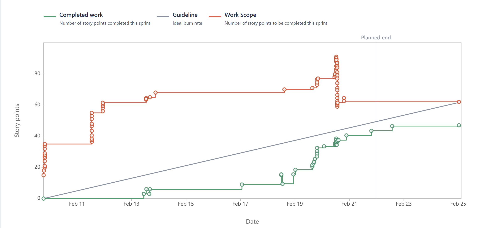
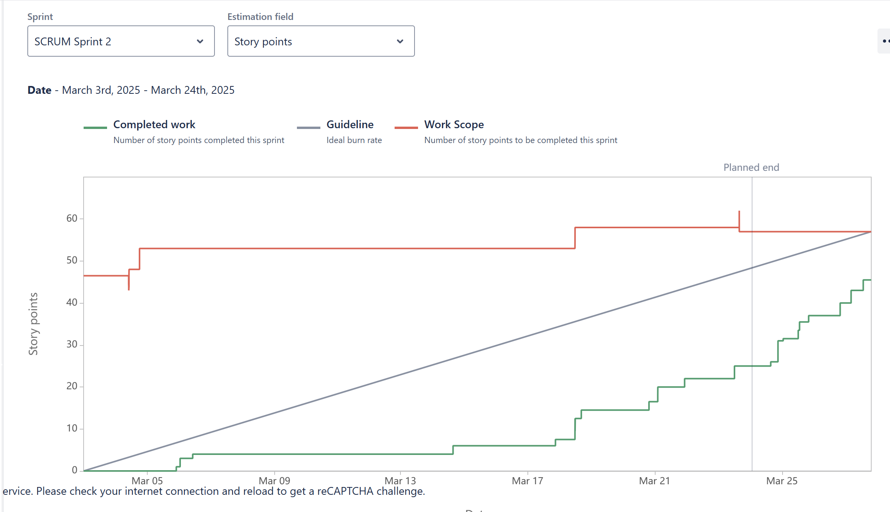

# On Par
#### This project is maintained by:
- Ariana Zapata
- Brandon Mason
- Jalen Stewart
- Natalie Morales
- Xavier Ortiz

> On Par is a two dimensional golf game for casual gamers who want a fun and relaxing game that they can play anytime, anywhere. Through simple controls and clear cut goals, our game will provide players with an experience that will challenge their precision and strategy skills. Through unlockable cosmetic items, the game will give the player a sense of achievement under little to no stress.

## Table of Contents
  - [General Information](#general-information)
  - [Technologies Used](#technologies-used)
  - [Sprint 1 Contributions](#sprint-1-contributions)
  - [Next Steps](#next-steps)
  - [Burnup Chart](#burnup chart for sprint 1)
  - [Features](#features)
  

## General Information

## Technologies Used
- [Unity Engine](https://unity.com/products/unity-engine)
- C#
- VSCode
- AI/ChatGPT

## Sprint 1 Contributions
Brandon Mason: 
Developed shot mechanics, including UI for power and angle selection, physics-based shot force calculations, and hole detection. Also worked on a game design document for golf club mechanics.

- SCRUM-11 Design and implement a UI for shot power and angle selection
    - Description: Created a user interface for players to select shot power and angle.
    - [Jira Link](https://cs3398-romulans-spring.atlassian.net/jira/software/projects/SCRUM/boards/1?selectedIssue=SCRUM-11)

- SCRUM-67 Add a hole to the board for the ball to go in to.
    - Description: Created a scoring system that maintains the player's total score across different levels while keeping track of individual level scores.
    - [Bitbucket Branch and Commit(s)](https://bitbucket.org/cs3398-romulans-s25/on-par/branch/SCRUM-67-add-a-hole-to-the-board-for-the)
    - [Pull Request](https://bitbucket.org/cs3398-romulans-s25/on-par/pull-requests/3)
    - [Jira Link](https://cs3398-romulans-spring.atlassian.net/jira/software/projects/SCRUM/boards/1?selectedIssue=SCRUM-67)

- SCRUM-12 Create a script to capture player input (mouse or keyboard) to adjust power and angle
    - Description: Developed input controls to modify shot power and angle.
    - [Bitbucket Branch and Commit(s)](https://bitbucket.org/cs3398-romulans-s25/on-par/branch/SCRUM-12-rebase-for-issue-key)
    - [Jira Link](https://cs3398-romulans-spring.atlassian.net/jira/software/projects/SCRUM/boards/1?selectedIssue=SCRUM-12)

- SCRUM-14 Test different force values to ensure smooth and predictable ball movement.
    - Description: Adjusted and tested force values for smooth ball motion.
    - [Jira Link](https://cs3398-romulans-spring.atlassian.net/jira/software/projects/SCRUM/boards/1?selectedIssue=SCRUM-14)

- SCRUM-13 Apply physics-based shot force calculations using Unity's Rigidbody2D (With visual display for aim and shot power).
    - Description: Integrated physics-based calculations for shot mechanics, including a visual display for aim and shot power.
    - [Bitbucket Branch and Commit(s)](https://bitbucket.org/cs3398-romulans-s25/on-par/branch/SCRUM-13-rebase-for-issue-key)
    - [Pull Request](https://bitbucket.org/cs3398-romulans-s25/on-par/pull-requests/3)
    - [Jira Link](https://cs3398-romulans-spring.atlassian.net/jira/software/projects/SCRUM/boards/1?selectedIssue=SCRUM-13)

- SCRUM-25 Create a game design document outlining the mechanics for each golf club type (Driver, Iron, and Putter).
    - Description: Documented golf club mechanics for the game, detailing differences between club types.
    - [Bitbucket Branch and Commit(s)](https://bitbucket.org/cs3398-romulans-s25/on-par/branch/SCRUM-25-alternate-method-using-scriptableobjects)
    - [Jira Link](https://cs3398-romulans-spring.atlassian.net/jira/software/projects/SCRUM/boards/1?selectedIssue=SCRUM-25)

Ariana Zapata:
Developed UI components, including the leaderboard panel, main menu UI, login UI, and guest functionality integration

- SCRUM-19 Design and implement a UI panel for the leaderboard.
    - Description: Created a leaderboard UI panel to display player rankings.
    - [Bitbucket Branch and Commit(s)](https://bitbucket.org/cs3398-romulans-s25/on-par/branch/SCRUM-19)
    - [Jira Link](https://cs3398-romulans-spring.atlassian.net/jira/software/projects/SCRUM/boards/1?selectedIssue=SCRUM-19)

- SCRUM-65 Integrate "Guest" Functionality
    - Description: Implemented guest login functionality to allow players to access the game without an account.
    - [Bitbucket Branch and Commit(s)](https://bitbucket.org/cs3398-romulans-s25/on-par/branch/SCRUM-65)
    - [Pull Request](https://bitbucket.org/cs3398-romulans-s25/on-par/pull-requests/14)
    - [Jira Link](https://cs3398-romulans-spring.atlassian.net/jira/software/projects/SCRUM/boards/1?selectedIssue=SCRUM-65)

- SCRUM-62 Design & Implement Main Menu UI
    - Description: Designed and implemented the main menu interface for easy game navigation.
    - [Bitbucket Branch and Commit(s)](https://bitbucket.org/cs3398-romulans-s25/on-par/branch/SCRUM-62)
    - [pull request](https://bitbucket.org/cs3398-romulans-s25/on-par/pull-requests/11)
    - [Jira Link](https://cs3398-romulans-spring.atlassian.net/jira/software/projects/SCRUM/boards/1?selectedIssue=SCRUM-62)

- SCRUM-63 Develop Login UI.
    - Description: Created a login UI that allows players to sign in and access their game progress.
    - [Bitbucket Branch and Commit(s)](https://bitbucket.org/cs3398-romulans-s25/on-par/branch/SCRUM-63)
    - [Jira Link](https://cs3398-romulans-spring.atlassian.net/jira/software/projects/SCRUM/boards/1?selectedIssue=SCRUM-62)

Natalie Morales: 
Implemented core gameplay mechanics, including stroke counting, score tracking, and golf club switching.

- SCRUM-49 Implement a user interface to display the current number of strokes per round
    - Description: Developed a stroke counter that tracks the number of strokes a player takes in a level.
    - [Bitbucket Branch and Commit(s)](https://bitbucket.org/cs3398-romulans-s25/on-par/branch/SCRUM-49-implement-a-user-interface-to-d)
    - [Jira Link](https://cs3398-romulans-spring.atlassian.net/jira/software/projects/SCRUM/boards/1?selectedIssue=SCRUM-49)

- SCRUM-48 Develop the logic to calculate the score for each hole and the cumulative total score.
    - Description: Created a scoring system that maintains the player's total score across different levels while keeping track of individual level scores.
    - [Bitbucket Branch and Commit(s)](https://bitbucket.org/cs3398-romulans-s25/on-par/branch/SCRUM-48-score-tracking-feature)
    - [Pull Request](https://bitbucket.org/cs3398-romulans-s25/on-par/pull-requests/13)
    - [Jira Link](https://cs3398-romulans-spring.atlassian.net/jira/software/projects/SCRUM/boards/1?selectedIssue=SCRUM-48)
    

 - SCRUM-27 implement a mechanism that allows you to switch between different clubs (driver, iron, putter)
    - Description: Allowed players to switch between different golf clubs (Driver, Iron, Putter), each affecting the shot differently.
    - [Bitbucket Branch and Commit(s)](https://bitbucket.org/cs3398-romulans-s25/on-par/branch/SCRUM-27-implement-a-mechanism-that-allo)
    - [Jira Link](https://cs3398-romulans-spring.atlassian.net/jira/software/projects/SCRUM/boards/1?selectedIssue=SCRUM-27)

Xavier Ortiz
Developed core gameplay levels, camera mechanics, and the Hole-in-One challenge logic and UI.

- SCRUM-60 Learning Unity
    - Description: Studied Unity development practices to better contribute to the project.
    - [Bitbucket Branch and Commit(s)](https://bitbucket.org/cs3398-romulans-s25/on-par/branch/SCRUM-60-learning-unity)
    - [Jira Link](https://cs3398-romulans-spring.atlassian.net/jira/software/projects/SCRUM/boards/1?selectedIssue=SCRUM-60)

- SCRUM-68 Making the camera following the golf ball/player
    - Description: Implemented a smooth camera-follow system to track the golf ball's movement.
    - [Bitbucket Branch and Commit(s)](https://bitbucket.org/cs3398-romulans-s25/on-par/branch/SCRUM-68-making-the-camera-following)
    - [Jira Link](https://cs3398-romulans-spring.atlassian.net/jira/software/projects/SCRUM/boards/1?selectedIssue=SCRUM-68)

 - SCRUM-34 Create 18 playable levels/courses for the game.
    - Description:  Designed and implemented 18 unique golf courses with different terrains and obstacles.
    - [Bitbucket Branch and Commit(s)](https://bitbucket.org/cs3398-romulans-s25/on-par/branches/?search=SCRUM-34)
    - [Jira Link](https://cs3398-romulans-spring.atlassian.net/jira/software/projects/SCRUM/boards/1?selectedIssue=SCRUM-34)

- SCRUM-70 Adding the hole script to all the levels
    - Description: Integrated hole detection mechanics into all game levels.
    - [Bitbucket Branch and Commit(s)](https://bitbucket.org/cs3398-romulans-s25/on-par/branch/SCRUM-70-adding-the-hole-script)
    - [Jira Link](https://cs3398-romulans-spring.atlassian.net/jira/software/projects/SCRUM/boards/1?selectedIssue=SCRUM-70)
    
- SCRUM-55 Design the Hole-in-One Challenge UI & Level Indicators
    - Description:  Created a UI display for the Hole-in-One challenge, including level indicators.
    - [Bitbucket Branch and Commit(s)](https://bitbucket.org/cs3398-romulans-s25/on-par/branch/SCRUM-55-design-the-hole-in-one-challenge)
    - [Jira Link](https://cs3398-romulans-spring.atlassian.net/jira/software/projects/SCRUM/boards/1?selectedIssue=SCRUM-55)

- SCRUM-56 Implement Hole-in-One Challenge Logic
    - Description: Developed the logic for the Hole-in-One challenge, ensuring correct scoring and mechanics.
    - [Bitbucket Branch and Commit(s)](https://bitbucket.org/cs3398-romulans-s25/on-par/branch/SCRUM-56-implement-hole-in-one-challenge)
    - [Jira Link](https://cs3398-romulans-spring.atlassian.net/jira/software/projects/SCRUM/boards/1?selectedIssue=SCRUM-56)

    

Jalen Stewart:
Developed obstacle and wind mechanics, including collision detection, wind trajectory effects, and UI elements for tracking wind direction.

 - SCRUM-29 Design the behavior and visual representation of obstacles (e.g., trees, water hazards, sand traps) and wind mechanics (e.g., direction, strength, visual indicators).
    - Description: Designed trees, water hazards, sand traps, and wind effects, including direction, strength, and visual indicators.
    - [Bitbucket Branch and Commit(s)](https://bitbucket.org/cs3398-romulans-s25/on-par/branch/SCRUM-29-design-the-behavior-and-visual-)
    - [Jira Link](https://cs3398-romulans-spring.atlassian.net/jira/software/projects/SCRUM/boards/1?selectedIssue=SCRUM-29)

- SCRUM-30 Implement obstacle collision detection and physics interactions in Unity.
    - Description: Developed physics-based interactions and collision detection for obstacles.
    - [Bitbucket Branch and Commit(s)](https://bitbucket.org/cs3398-romulans-s25/on-par/branch/SCRUM-30-implement-obstacle-collision-de)
    - [Jira Link](https://cs3398-romulans-spring.atlassian.net/jira/software/projects/SCRUM/boards/1?selectedIssue=SCRUM-30)

 - SCRUM-31 implement a mechanism that allows you to switch between different clubs (driver, iron, putter)
    - Description: Implemented wind effects that dynamically affect ball movement.fect ball movement.
    - [Bitbucket Branch and Commit(s)](https://bitbucket.org/cs3398-romulans-s25/on-par/branch/SCRUM-31-add-wind-mechanics-to-influence)
    - [Jira Link](https://cs3398-romulans-spring.atlassian.net/jira/software/projects/SCRUM/boards/1?selectedIssue=SCRUM-31)

- SCRUM-69 Create wind UI to track the wind and direction.
    - Description: Developed an on-screen UI to visually display wind direction and intensity.
    - [Bitbucket Branch and Commit(s)](https://bitbucket.org/cs3398-romulans-s25/on-par/branch/SCRUM-69-create-wind-ui-to-track-the-win)
    - [Jira Link](https://cs3398-romulans-spring.atlassian.net/jira/software/projects/SCRUM/boards/1?selectedIssue=SCRUM-69)
    

 - SCRUM-33 Add obstacles and wind to existing or new game courses.
    - Description: Integrated obstacles and wind mechanics into different golf course designs.
    - [Bitbucket Branch and Commit(s)](https://bitbucket.org/cs3398-romulans-s25/on-par/branch/SCRUM-33-adjust-sand-logic)
    - [Jira Link](https://cs3398-romulans-spring.atlassian.net/jira/software/projects/SCRUM/boards/1?selectedIssue=SCRUM-33)

## Next Steps for Sprint 2
  - Brandon Mason:
      - Start working on the server for account creation and score storage.
      - Create a secure sign up system.
      - Integrate the server into the login and leaderboard pages in the game.
  - Ariana Zapata:
      - Finish developing login system
      - Continue leaderboard development; keeping track of players' scores
      - Create seamless path from main menu to game
      - Make sure UI is consistent throughout the application
  - Natalie Morales
      - A feature that implements Lava pits that instantly reset the ball.
      - implement a neater and more in depth UI for features such as clubs, wind text, scores. 
      - Sync in-game lighting with the player's real-world time for a dynamic day-night cycle.
  - Xavier Ortiz: 
      - Continue working on my hole-in-challege and UI look
      - Create a reward track for completing the challeges
      - Create a couple of custom golf balls to choose from
  - Jalen Stewart:
      - Continue working on sand to make it more realistic
      - Add unique hazards and features that interact with the ball during the game
      - Create visual indicator for the shooting mechanic, a power meter

## Burnup Chart for Sprint 1

## Sprint 2 Contributions
Brandon Mason: 

Ariana Zapata:
Enhanced backend integration and expanded UI functionality, including login/signup database linkage, score tracking, AccountView development, and bug fixes.

- SCRUM-120 Main Menu/Login UI Updates
    Description: Made layout and button adjustments to improve usability and consistency in the main menu and login views.
    - [Bitbucket Branch and Commit(s)](https://bitbucket.org/cs3398-romulans-s25/on-par/branch/SCRUM-120-update-mainmenu-ui)
    - [Jira](https://cs3398-romulans-spring.atlassian.net/browse/SCRUM-120?atlOrigin=eyJpIjoiNTkyZjYwMjYxMzdhNDE1ZTk0ODUzZjZlNjcwNmM0MDIiLCJwIjoiaiJ9)

- SCRUM-121 Backend Integration with UI (Login/Signup + AccountView)
    Description:
    – Connected login and signup UI functionality to backend database methods.
    – Implemented OnLoginAttempt and OnSignupAttempt event handlers in LoginController.cs.
    – Created initial AccountView and AccountController components to display user info after login.
    – Set up navigation path to AccountMenu.
    – Iterated UI adjustments based on testing and feedback.
    - [Bitbucket Branch and Commit(s)](https://bitbucket.org/cs3398-romulans-s25/on-par/branch/SCRUM-121-connect-ui-to-backend-methods)
    - [Jira](https://cs3398-romulans-spring.atlassian.net/browse/SCRUM-121?atlOrigin=eyJpIjoiYzI0ZDM5MjcxZTk0NDZiYzk0ZTg4YjJkZTQ5OGVjODciLCJwIjoiaiJ9)

- SCRUM-111 Asset and UI Script Additions
    Description: Added new UI assets and scripts to support the AccountView and improve visual consistency.
    - [Bitbucket Branch and Commit(s)](https://bitbucket.org/cs3398-romulans-s25/on-par/branch/SCRUM-111-design-leaderboard-ui)
    - [Jira](https://cs3398-romulans-spring.atlassian.net/browse/SCRUM-111?atlOrigin=eyJpIjoiOGRmNDQ1ZjRiNzUwNDJjY2E1ZmQxMjMxYzQ4ZmZmMzMiLCJwIjoiaiJ9)

- SCRUM-116 Debugging and UI Fixes
    Description: Conducted extensive debugging of UI flow and backend integration. Fixed bugs, adjusted code logic, and ensured components (like GuestView, AccountView, LoginView) were correctly connected in the Unity project.
    - [Bitbucket Branch and Commit(s)](https://bitbucket.org/cs3398-romulans-s25/on-par/branch/SCRUM-116-test-debug)
    - [Pull Request](https://bitbucket.org/%7B819012b1-8676-40ce-9231-5a0e59ffe448%7D/%7B97904684-973f-4a89-aeae-8ca5feb4a5d4%7D/pull-requests/30)
    - [Jira](https://cs3398-romulans-spring.atlassian.net/browse/SCRUM-116?atlOrigin=eyJpIjoiYTA1Njg1M2ZiMWY0NDE4MTgzOTg0MzVhMmEwZTQxZGUiLCJwIjoiaiJ9)

Natalie Morales: 
Redesigned the levels on the UI development to look cohesive with Main Menu, implemented a settings panel that connects UI and levels through Guest, Created a prefab for wind animation using Unity’s particle effect, and created a soundManager to create instances of sounds throughout the game. 

- SCRUM-77 Create animation for wind into a prefab
    - Description: Used Unity’s particle effect to create wind animations that move and act  like wind.
    - [Bitbucket Branch and Commit(s)](https://bitbucket.org/cs3398-romulans-s25/on-par/branch/SCRUM-77-create-animation-to-enhance-use)
    - [Jira Link](https://cs3398-romulans-spring.atlassian.net/jira/software/projects/SCRUM/boards/1?selectedIssue=SCRUM-77)

- SCRUM-78 Implement subtle sound effect for hitting the golf ball
    - Description: Created SoundFXManager object and script that instantiates sounds throughout the game by creating an audio source of your choosing. We applied this to the ball to create a hitting sound. 
    - [Bitbucket Branch and Commit(s)](https://bitbucket.org/cs3398-romulans-s25/on-par/branch/SCRUM-78-implement-subtle-sound-effects-)
    - [Pull Request](https://bitbucket.org/%7B819012b1-8676-40ce-9231-5a0e59ffe448%7D/%7B97904684-973f-4a89-aeae-8ca5feb4a5d4%7D/pull-requests/20)
    - [Jira Link](https://cs3398-romulans-spring.atlassian.net/jira/software/projects/SCRUM/boards/1?selectedIssue=SCRUM-78)

- SCRUM-76 Create a UI that has consistent fonts, colors, and button styles across all screens and displays all player information (score, current club, etc.).
    - Description: Changed the UI to all the levels to better match the Main Menu graphics.
    - [Bitbucket Branch and Commit(s)](https://bitbucket.org/cs3398-romulans-s25/on-par/branch/SCRUM-76-Second-UI-branch)
    - [Jira Link](https://cs3398-romulans-spring.atlassian.net/jira/software/projects/SCRUM/boards/1?selectedIssue=SCRUM-76)

 
- SCRUM-79 Make a settings button/panel that allows you to change the game settings (volume, back button to main menu, skins, etc.
    - Description: Created a settings panel that is accessible from every level and inside the panel the player can access the main menu and vice versa. It connects through GuestController.
    - [Bitbucket Branch and Commit(s)](https://bitbucket.org/cs3398-romulans-s25/on-par/branch/SCRUM-79-make-a-settings-button-panel-th)
    - [Pull Request](https://bitbucket.org/cs3398-romulans-s25/on-par/pull-requests/31)
    - [Jira Link](https://cs3398-romulans-spring.atlassian.net/jira/software/projects/SCRUM/boards/1?selectedIssue=SCRUM-79)

Xavier Ortiz:
I finished implementing the challenge UI banner and logic and added rewards (coins) for completing the challenges, and just for completing the level, you were given rewards.

- SCRUM-93 Design & Implement UI for Challenges and Rewards (Unity UI)
    - Description: Create UI elements in Unity (e.g., TextMeshPro, UI Panels) to display the challenge details and earned rewards. Develop a C# script to update UI dynamically based on challenge progress and completion. Ensured UI scales properly across different screen resolutions.
    - [Bitbucket Branch and Commit(s)](https://bitbucket.org/cs3398-romulans-s25/on-par/branch/SCRUM-93-design-implement-ui-for-challen)
    - [Jira Link](https://cs3398-romulans-spring.atlassian.net/jira/software/projects/SCRUM/boards/1?selectedIssue=SCRUM-93)
    
- SCRUM-72 Hole In One Challenge Logic - Working off of SCRUM-56-55
    - Description: Pulling SCRUM-56: Implement Hole-in-One Challenge Logic into sprint 2 from sprint 1 to work on. Still need to add more quality changes and to make it run with team mates code.
    - [Bitbucket Branch and Commit(s)](https://bitbucket.org/cs3398-romulans-s25/%7B97904684-973f-4a89-aeae-8ca5feb4a5d4%7D/branch/SCRUM-72-hole-in-one-REDO)
    - [Jira Link](https://cs3398-romulans-spring.atlassian.net/jira/software/projects/SCRUM/boards/1?selectedIssue=SCRUM-72)

- SCRUM-71 Hole In One UI - Working off of SCRUM-55-56
    - Description: Pulling SCRUM-55: Design the Hole-in-One Challenge UI & Level Indicators into sprint 2 from sprint 1 to work on. Still need to add more quality changes and to make it run with team mates code. 
    - [Bitbucket Branch and Commit(s)](https://bitbucket.org/cs3398-romulans-s25/%7B97904684-973f-4a89-aeae-8ca5feb4a5d4%7D/branch/SCRUM-72-hole-in-one-REDO)
    - [Bitbucket Branch and Commit(s)](https://bitbucket.org/cs3398-romulans-s25/%7B97904684-973f-4a89-aeae-8ca5feb4a5d4%7D/branch/SCRUM-71-hole-in-one-UI-Continuing)
    - [Jira Link](https://cs3398-romulans-spring.atlassian.net/jira/software/projects/SCRUM/boards/1?selectedIssue=SCRUM-71)
    
- SCRUM-91 Implement Challenge Activation Logic in C# (Unity Script)
    - Description: Write a C# script in Unity to determine which holes have active challenges. Use Unity's ScriptableObject or GameManager to manage challenge activation conditions. Test by logging activations in Unity's console to ensure proper behavior. 
    - [Bitbucket Branch and Commit(s)](https://bitbucket.org/cs3398-romulans-s25/%7B97904684-973f-4a89-aeae-8ca5feb4a5d4%7D/branch/SCRUM-91-implement-challenge-activation-)
    - [Jira Link](https://cs3398-romulans-spring.atlassian.net/jira/software/projects/SCRUM/boards/1?selectedIssue=SCRUM-91)
    
- SCRUM-92 Develop Performance-Based Reward System in C#
    - Description: Create a C# script to calculate challenge performance (e.g., accuracy, completion time). Implement reward logic using Unity’s PlayerPrefs or a custom data-saving method. Ensure rewards are dynamically adjusted based on challenge difficulty.
    - [Bitbucket Branch and Commit(s)](https://bitbucket.org/cs3398-romulans-s25/%7B97904684-973f-4a89-aeae-8ca5feb4a5d4%7D/branch/SCRUM-92-develop-performance-based-rewar)
    - [Jira Link](https://cs3398-romulans-spring.atlassian.net/jira/software/projects/SCRUM/boards/1?selectedIssue=SCRUM-92)
    
- SCRUM-90 Design Challenge Mechanics & Reward System
    - Descriptions: Create a design document outlining the challenge types, scoring system, and reward tiers. Use a flowchart or state diagram to visualize how challenges activate and how rewards are assigned. Store the document in the Unity project folder for reference.
    - [Bitbucket Branch and Commit(s)](https://bitbucket.org/cs3398-romulans-s25/%7B97904684-973f-4a89-aeae-8ca5feb4a5d4%7D/branch/SCRUM-90-design-challenge-mechanics-rewa)
    - [Jira Link](https://cs3398-romulans-spring.atlassian.net/jira/software/projects/SCRUM/boards/1?selectedIssue=SCRUM-90)

Jalen Stewart:
Jalen Stewart: Created a power meter bar that synced the shot to correlate with the matching animation left room to add percentage text.Added different images and sprites into the prefabs. Began research for changing the layout for the sand hazard. 

- Scrum-107: Create a power meter UI with a specific visual style to fit games theme
- [Bitbucket Branch and Commit(s)] https://bitbucket.org/cs3398-romulans-s25/on-par/branch/SCRUM-107-create-power-meter-ui
- [Jira Link]https://cs3398-romulans-spring.atlassian.net/jira/software/projects/SCRUM/boards/1?selectedIssue=SCRUM-107

- Scrum-106: Implement the power meter logic 
- [Bitbucket Branch and Commit(s)] https://bitbucket.org/cs3398-romulans-s25/on-par/branch/SCRUM-106-design-the-power-meter-ui
- [Jira Link]https://cs3398-romulans-spring.atlassian.net/jira/software/projects/SCRUM/boards/1?selectedIssue=SCRUM-106

- Scrum-108: Sync Power Meter With Shot Strength
- [Bitbucket Branch and Commit(s)] https://bitbucket.org/cs3398-romulans-s25/on-par/branch/SCRUM-108-sync-power-meter-with-shot-str
- [Jira Link]https://cs3398-romulans-spring.atlassian.net/jira/software/projects/SCRUM/boards/1?selectedIssue=SCRUM-108

- Scrum-109: Test Power Meter Usability
- [Bitbucket Branch and Commit(s)] https://bitbucket.org/cs3398-romulans-s25/on-par/branch/SCRUM-109-test-power-meter-usability
- [Jira Link]https://cs3398-romulans-spring.atlassian.net/jira/software/projects/SCRUM/boards/1?selectedIssue=SCRUM-109
- Pull Request: https://bitbucket.org/cs3398-romulans-s25/on-par/pull-requests/29

## Next Steps for Sprint 3

- Brandon Mason: 

- Ariana Zapata:
    - Connect Leaderboard to Database: Implement backend integration for the leaderboard so it displays real-time player rankings based on scores stored in the database.
    - Finalize Leaderboard UI: Polish the visual design of the leaderboard panel and ensure it dynamically updates with correct styling and scroll behavior.
    - Implement "All Levels" View: Create a new UI view that allows users to access any previously unlocked level. Ensure this view reflects the player's progress and includes locked/unlocked states visually.
    - Add Password Visibility Toggle: Enhance the login UI with a security feature that allows users to toggle visibility of their typed password (e.g., a "show/hide" eye icon).

- Natalie Morales: 
    - Working with team to incorporate the wind animations prefab to work with a wind api so it follows the same direction.
    - redesigning score manager so the player can start from any level once unlocked.
    - connect sounds to the volume slider in settings and add background music that a player can personalize. 

- Xavier Ortiz:
    - Create a daily reward tracker for every time the user logs in to the game. Will be given coins or maybe cosmetics.
    - Create 6-10 challenge levels that are based on the hole-in-one challenge, that you only have a few attempts to beat or else you restart.
    - Make a UI that shows up after you complete a levels which you can exit the game or restart level, etc.,instead of just force loading the level.

- Jalen Stewart:
    - Complete Sand and other hazards for more uniqueness and playability
    - Implement an API to effect the wind patterns in a more durastic way
    - Creating the UI for the rewards panel

## Burnup Chart for Sprint 2

## Features
- Mouse controls - Will launch the ball into the air.
- 18 Custom golf courses
- Stroke Counter Tracks the number of strokes per level.
- Total Score Tracking and Maintains the player's score across different levels.
- Golf Club Selection Switch between Driver, Iron, and Putter, each affecting the shot differently.
- Wind Mechanics Wind dynamically influences ball trajectory based on direction and strength.
- Obstacles and Hazards Trees, water hazards, sand traps, and other environmental challenges.
- Main Menu & Navigation Easy access to game modes and settings.
- Leaderboard UI Tracks top scores for competitive play.
- Realistic Shot Force System Uses Unity Rigidbody2D for accurate physics-based golf shots.
- Collision Detection Ensures the ball interacts correctly with terrain, walls, and obstacles.
- Camera Follow System Automatically tracks the ball after each shot.
- wind animations
- sound effects in game 
